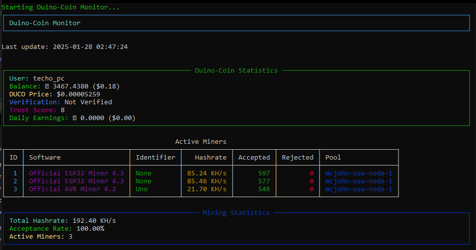

#pt-br
# Duino-Coin CLI Monitor

Um monitor de linha de comando (CLI) para acompanhar suas estatísticas de mineração e saldo do Duino-Coin.

## Funcionalidades

- 🖥️ Interface de terminal rica e colorida usando Rich
- 💰 Acompanhamento de saldo em DUCO e USD
- ⛏️ Monitoramento de mineradores ativos
- 📊 Estatísticas de hashrate e taxa de aceitação
- 📈 Cálculo de ganhos diários
- 🔄 Atualização automática em intervalos configuráveis
- 🔐 Gerenciamento de nome de usuário persistente

## Requisitos

- Python 3.6 ou superior
- Conexão com a internet

## Instalação

1. Clone o repositório:
2. bash git clone https://github.com/seu-usuario/duino-cli-monitor.git
3. cd duino-cli-monitor
4. python cli_monitor.py

### Opções de linha de comando:
- `-i` ou `--interval`: Define o intervalo de atualização em segundos (padrão: 60)
- `--reset`: Reseta o nome de usuário salvo
- `--install-deps`: Instala as dependências e sai

## Captura de Tela

## Contribuição

Contribuições são bem-vindas! Siga estes passos:

1. Faça um fork do projeto
2. Crie uma branch para sua feature (`git checkout -b feature/AmazingFeature`)
3. Commit suas mudanças (`git commit -m 'Add some AmazingFeature'`)
4. Push para a branch (`git push origin feature/AmazingFeature`)
5. Abra um Pull Request

## Licença

Distribuído sob a licença MIT. Veja `LICENSE` para mais informações.

## Contato

TECHO_PC ( Meketreve )

Link do Projeto: [https://github.com/seu-usuario/duino-cli-monitor](https://github.com/seu-usuario/duino-cli-monitor)

# EN
# Duino-Coin CLI Monitor

A command-line interface (CLI) monitor for tracking your Duino-Coin mining statistics and balance.

## Features

- 🖥️ Rich and colorful terminal interface using Rich
- 💰 Balance tracking in DUCO and USD
- ⛏️ Active miners monitoring
- 📊 Hashrate and acceptance rate statistics
- 📈 Daily earnings calculation
- 🔄 Automatic updates at configurable intervals
- 🔐 Persistent username management

## Requirements

- Python 3.6 or higher
- Internet connection

## Installation

1. Clone the repository: git clone https://github.com/your-username/duino-cli-monitor.git
2. cd duino-cli-monitor
3. Install dependencies: pip install -r requirements.txt

## Usage

Run the monitor: python cli_monitor.py

### Command-line options:
- `-i` or `--interval`: Set the update interval in seconds (default: 60)
- `--reset`: Reset the saved username
- `--install-deps`: Install dependencies and exit

## Screenshot

## Contributing

Contributions are welcome! Follow these steps:

1. Fork the project
2. Create a feature branch (`git checkout -b feature/AmazingFeature`)
3. Commit your changes (`git commit -m 'Add some AmazingFeature'`)
4. Push to the branch (`git push origin feature/AmazingFeature`)
5. Open a Pull Request

## License

Distributed under the MIT License. See `LICENSE` for more information.

## Contact

TECHO_PC ( Meketreve )

Project Link: [https://github.com/your-username/duino-cli-monitor](https://github.com/your-username/duino-cli-monitor)
